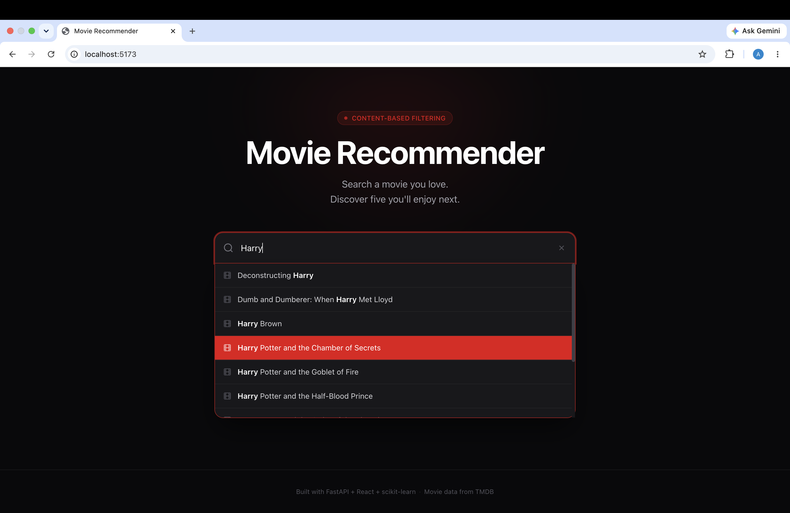
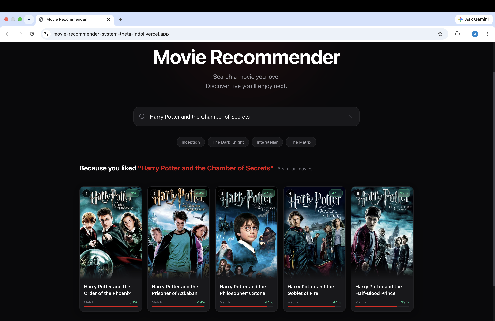
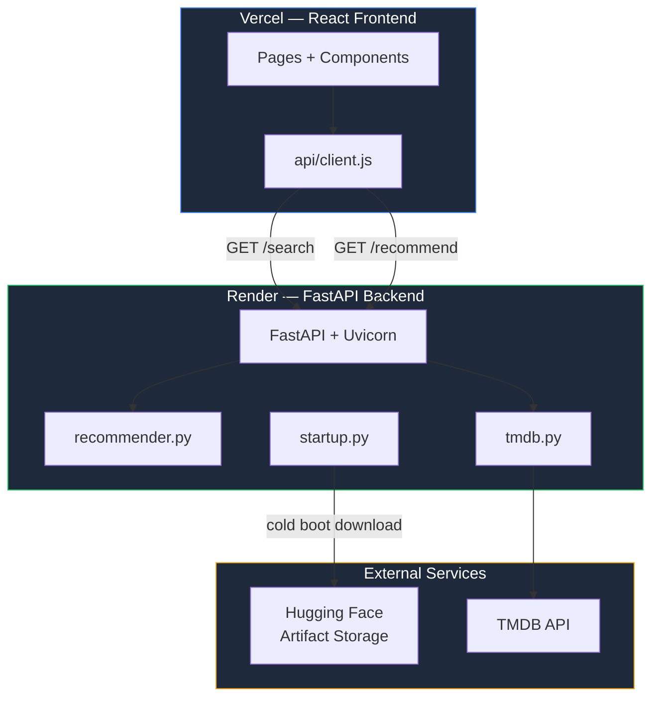

<div align="center">

# 🎬 ML-Powered Movie Recommendation System
### Content-based recommendation engine — fully deployed, full-stack.

**[Live Demo](https://movie-recommender-system-theta-indol.vercel.app) &nbsp;·&nbsp; [API Explorer](https://movie-recommender-api-plrh.onrender.com/docs) &nbsp;·&nbsp; [Health Check](https://movie-recommender-api-plrh.onrender.com/health)**


</div>

---
## Screenshots


*Debounced search with substring match highlighting and keyboard navigation.*


*Success state — five cards with posters, rank badges, match scores, similarity bars.*

---

## What This Is

A production-deployed movie recommendation engine built end-to-end — data pipeline →
ML model → REST API → React frontend → cloud deployment on three platforms.

The recommendation model originated in a notebook. This repository contains the engineering required to turn that model into a deployed application. 

> ⚠️ Backend runs on Render's free tier. The first request after inactivity may take up to 30 seconds while the service wakes up.

---

## Highlights

| | |
|---|---|
| **Dataset** | 5,000+ TMDB movies with genres, keywords, cast, and director metadata |
| **Recommendation Engine** | NLP feature engineering + cosine similarity |
| **Artifact Storage** | 176MB similarity matrix hosted on Hugging Face |
| **Backend** | FastAPI with Pydantic-based API contracts |
| **Frontend** | React + Vite with autocomplete search and recommendation UI |
| **Deployment** | Render (API) · Vercel (Frontend) · Hugging Face (Artifacts) |
| **API Documentation** | Auto-generated via FastAPI OpenAPI schema |
| **Status** | Live and publicly accessible |

---

## System Architecture



**Core architectural principle:** `recommender.py` imports nothing from FastAPI or any
UI framework. It is a pure Python module. The same file powered the Streamlit v1
prototype and powers the production API without modification.

---

## Recommendation Pipeline
TMDB movies + credits CSVs

↓

Feature extraction — genres, keywords, top 3 cast, director

↓

Porter stemming + normalization → tag string per movie

↓

CountVectorizer (max_features=5000, stop_words='english')

↓

Cosine similarity matrix  →  similarity.pkl (176MB)

Movie DataFrame           →  movies.pkl (2.1MB)

↓

Serialized to Hugging Face — downloaded once at API startup

Served from memory — zero ML computation per request

CountVectorizer chosen over TF-IDF (penalizes high-frequency genre/keyword terms
incorrectly here) and embeddings (400MB+ model weight, per-request inference latency,
unjustified complexity for a 5,000-item catalog with categorical metadata).

---

## Key Engineering Decisions

**FastAPI over Flask** — Pydantic response models make the API contract explicit and
machine-validated. When `recommender.py` was updated to include `score`, the Pydantic
model was the single place that propagated this change to the frontend. Auto-generated
`/docs` is accurate because it derives from the types, not separate documentation.

**Hugging Face for artifacts** — Git hard limit is 100MB. The similarity matrix is
176MB. Git LFS adds billing and bandwidth constraints. Hugging Face is CDN-backed,
free, and purpose-built for ML artifacts. `startup.py` downloads artifacts at boot,
skips if already cached — idempotent, zero overhead on warm redeploys.

**Environment-variable-driven CORS** — `ALLOWED_ORIGINS` is read from env, defaulting
to `"*"` locally and locked to the Vercel URL in production. Same codebase, correct
security posture per environment, no code changes between deploys.

**Centralized API layer** — Frontend API communication is routed through a dedicated client module, keeping request logic and environment-specific configuration isolated from UI components.

---

## Engineering Challenges

### 176MB artifact in a Git-based deployment pipeline

GitHub's 100MB file limit made committing `similarity.pkl` impossible. Computing the
matrix at startup adds ~2 minutes to cold boot and wastes RAM during construction.

**Solution:** `startup.py` runs before uvicorn in Render's start command:
python startup.py && uvicorn backend.main:app --host 0.0.0.0 --port $PORT
Downloads from Hugging Face on first boot, skips on subsequent deploys. If the download
fails, the process exits — Render reports a failed deploy, not a silently broken API.

**Result:** Cold boot ~4min. Warm redeploy ~45s. API never starts in a broken state.

---

### Absolute paths for cross-environment reliability

Relative paths like `open('data/movies.pkl')` break when the working directory is not
the project root — a real issue on Render where the working directory is not guaranteed.

**Solution:**
```python
BASE_DIR = os.path.dirname(os.path.abspath(__file__))
movies = pickle.load(open(os.path.join(BASE_DIR, 'data', 'movies.pkl'), 'rb'))
```
`__file__` resolves correctly regardless of where the process starts.

---

## Deployment Architecture
GitHub push → main

├── Render

│     1. pip install -r requirements.txt

│     2. python startup.py   ← downloads artifacts if missing

│     3. uvicorn backend.main:app --host 0.0.0.0 --port $PORT

│

└── Vercel

1. npm install && npm run build

└── VITE_API_URL injected at build time

2. Deploy dist/ to edge CDN

| Variable | Platform | Value |
|---|---|---|
| `TMDB_API_KEY` | Render | TMDB v3 API key |
| `ALLOWED_ORIGINS` | Render | `https://movie-recommender-system-theta-indol.vercel.app` |
| `VITE_API_URL` | Vercel | `https://movie-recommender-api-plrh.onrender.com` |

---

## API Reference

| Endpoint | Description |
|---|---|
| `GET /health` | Liveness check — confirms matrix loaded, returns movie count |
| `GET /search?q=batman` | Autocomplete — up to 10 case-insensitive title matches |
| `GET /recommend?title=Inception&n=5` | Top-n similar movies with scores and poster URLs |

All errors return `{ "detail": "..." }` — validated by Pydantic, consumed explicitly
by the frontend error handler.

Full interactive docs: **[API Explorer](https://movie-recommender-api-plrh.onrender.com/docs)**

---

## Repository Structure
```text
movie-recommender/

├── backend/                # FastAPI application and API routes
├── frontend/               # React frontend
├── recommender.py          # Recommendation engine
├── tmdb.py                 # TMDB integration
├── startup.py              # Artifact download and startup preparation
├── requirements.txt
├── notebooks/              # Data preprocessing and model development
└── data/                   # Downloaded model artifacts
```
---

## Local Setup

```bash
git clone https://github.com/ayushigupta6279/movie-recommender.git
cd movie-recommender

python -m venv venv && source venv/bin/activate
pip install -r requirements.txt

cp .env.example .env          # Add TMDB_API_KEY
python startup.py             # Downloads artifacts (~178MB, one-time)

uvicorn backend.main:app --reload     # API → localhost:8000/docs

cd frontend && npm install && npm run dev   # UI → localhost:5173
```

---

## Future Improvements

- **Redis cache** on `/recommend` — results are deterministic, repeat requests
  shouldn't execute Python
- **Hybrid collaborative filtering** — combine content similarity with implicit
  co-watch signals to reduce over-specialization on metadata features
- **Model versioning** — track preprocessing parameters alongside artifact versions
  (MLflow or DVC)
- **Uptime monitoring** — ping `/health` every 14min to prevent Render free tier sleep

---

## Resume Highlights

- Architected and deployed a full-stack ML recommendation system (FastAPI + React +
  scikit-learn); serves recommendations from an in-memory cosine similarity matrix loaded at startup
- Solved a 176MB artifact / 100MB Git limit constraint with an idempotent boot-time
  downloader using Hugging Face, with hard-fail behavior on download errors
- Designed Pydantic API contracts enforcing frontend-backend data shape at the framework
  level; propagated schema changes with a single file edit
- Deployed across Render + Vercel + Hugging Face with environment-variable-driven CORS —
  identical codebase runs correctly in dev and production without modification

---

<div align="center">

**[Live Demo](https://movie-recommender-system-theta-indol.vercel.app) &nbsp;·&nbsp; [API Docs](https://movie-recommender-api-plrh.onrender.com/docs)**

*Built end-to-end — data pipeline · ML model · REST API · React frontend · cloud deployment*

</div>